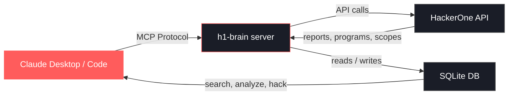
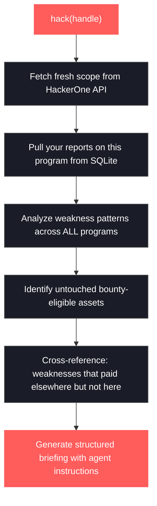

# h1-brain

An MCP server that connects your AI assistant to HackerOne. It pulls your bug bounty history, program scopes, and report details into a local SQLite database, then exposes tools that let any MCP-compatible client (Claude Desktop, Claude Code, etc.) search, analyze, and build on your past work.

The primary tool, `hack(handle)`, generates a full hacking session briefing in a single call: fresh scope from the API, your past findings on that program, weakness patterns from your global track record, untouched assets, and suggested attack vectors — all formatted as actionable instructions for the AI.

## How It Works

For a full walkthrough, check out the three-part **[Bug Bounty Goldfish](https://clawd.it/series/bug-bounty-goldfish/)** series:

1. **[Teaching Claude Everything You've Hacked](https://clawd.it/posts/11-teaching-claude-everything-youve-hacked/)** — Why I built h1-brain and how to set it up
2. **[What h1-brain Actually Does](https://clawd.it/posts/12-what-h1-brain-actually-does/)** — Every tool explained, from search to the `hack()` briefing
3. **[Running h1-brain Against a Real Target](https://clawd.it/posts/13-running-h1-brain-against-a-real-target/)** — A start-to-finish walkthrough on an actual program





## Requirements

- Python 3.10+
- A HackerOne API token ([generate one here](https://hackerone.com/settings/api_token))

## Setup

```bash
git clone https://github.com/user/h1-brain.git
cd h1-brain
python -m venv venv
source venv/bin/activate
pip install -r requirements.txt
```

## Connecting to Claude

### Claude Desktop

Add to `~/Library/Application Support/Claude/claude_desktop_config.json`:

```json
{
  "mcpServers": {
    "h1-brain": {
      "command": "/path/to/h1-brain/venv/bin/python",
      "args": ["/path/to/h1-brain/server.py"],
      "env": {
        "H1_USERNAME": "your_hackerone_username",
        "H1_API_TOKEN": "your_api_token"
      }
    }
  }
}
```

Restart Claude Desktop after saving.

### Claude Code

```bash
claude mcp add h1-brain \
  -e H1_USERNAME=your_hackerone_username \
  -e H1_API_TOKEN=your_api_token \
  -- /path/to/h1-brain/venv/bin/python /path/to/h1-brain/server.py
```

Or add manually to `.claude/settings.json`:

```json
{
  "mcpServers": {
    "h1-brain": {
      "command": "/path/to/h1-brain/venv/bin/python",
      "args": ["/path/to/h1-brain/server.py"],
      "env": {
        "H1_USERNAME": "your_hackerone_username",
        "H1_API_TOKEN": "your_api_token"
      }
    }
  }
}
```

## First Run

After connecting, populate your local database:

1. **`fetch_rewarded_reports`** — Pulls all your bounty-awarded reports, including full vulnerability write-ups and attachment metadata. This is the most important step.
2. **`fetch_programs`** — Pulls all programs you have access to.

These only need to be run once. Re-run periodically to sync new reports.

## Tools

### `hack(handle)`

The primary entry point. One call does everything:

1. Fetches fresh program scopes from the HackerOne API
2. Pulls your past rewarded reports for that program from the local database
3. Cross-references your full report history for weakness patterns
4. Identifies untouched in-scope assets you haven't reported on yet
5. Suggests attack vectors based on weaknesses that paid off on other programs but haven't been found here
6. Returns a structured markdown briefing with embedded agent instructions

The output is designed to double as agent instructions — the AI reads the briefing and immediately knows the scope, history, and where to focus.

**Briefing structure:**

- **Scope** — bounty-eligible and non-bounty assets with severity caps and instructions
- **Your Past Findings** — rewarded reports on this program with severity, weakness type, and bounty amounts
- **Weakness Types That Worked** — frequency of each weakness type you've been rewarded for here
- **Untouched Scope** — bounty-eligible assets with zero findings from you
- **Suggested Attack Vectors** — weakness types rewarded on other programs but not yet found here, ranked by frequency
- **Instructions** — directs the AI to assist within the defined scope

### Search Tools

These query the local SQLite database. No API calls, instant results.

| Tool | Description |
|------|-------------|
| `search_reports(query, program, weakness, severity, limit)` | Search reports by title, program handle, weakness type (e.g. `"SSRF"`, `"XSS"`), or severity rating (`critical`, `high`, `medium`, `low`). All filters are optional and combined with AND. Returns results sorted by bounty amount with vulnerability snippets. |
| `search_programs(query, bounty_only, limit)` | Search programs by handle or name. Optionally filter to bounty-only programs. |
| `search_scopes(program, asset, bounty_only, limit)` | Search assets across all stored programs. Filter by program handle, asset identifier, or bounty eligibility. |
| `get_report(report_id)` | Full report details: metadata, severity, weakness, bounty, vulnerability write-up, and attachment list with IDs. |
| `get_report_summary()` | Summary of all rewarded reports grouped by program with report counts and bounty totals. |

### Attachment Tools

| Tool | Description |
|------|-------------|
| `fetch_attachment(report_id, attachment_id?)` | Fetches fresh download URLs for report attachments. URLs expire after ~1 hour. If `attachment_id` is omitted, returns URLs for all attachments on the report. |

Attachment metadata (file name, type, size) is stored locally during `fetch_rewarded_reports`. The actual files live on S3 with expiring URLs, so `fetch_attachment` hits the API each time to get a fresh link.

### Data Sync Tools

These fetch data from the HackerOne API and store it locally.

| Tool | Description |
|------|-------------|
| `fetch_rewarded_reports` | Pulls all bounty-awarded reports with full details, vulnerability write-ups, and attachment metadata. Fetches report details concurrently (10 at a time). |
| `fetch_programs` | Pulls all accessible programs. |
| `fetch_program_scopes(handle)` | Pulls structured scopes for a specific program. Called automatically by `hack()`. |

## Architecture

```
server.py          Single-file MCP server
h1_data.db         SQLite database (auto-created on first run)
requirements.txt   Python dependencies (mcp, httpx)
```

### Database Schema

- **reports** — id, title, state, dates, program_handle, weakness (name + CWE), severity (rating + score), bounty (amount + currency), vulnerability_information, disclosed_at
- **programs** — id, handle, name, submission_state, offers_bounties, currency
- **scopes** — id, program_handle, asset_identifier, asset_type, bounty/submission eligibility, max_severity, instruction
- **attachments** — id, report_id, file_name, content_type, file_size, created_at

All tables are indexed on common query fields. The database uses WAL mode for concurrent reads.

### API Integration

- Authenticates via HackerOne API v1 Basic Auth
- Handles pagination automatically (100 items per page)
- Rate limit handling with automatic retry (60s backoff on 429)
- Concurrent report detail fetching (semaphore-limited to 10)

## Author

**Patrik Grobshäuser** — [LinkedIn](https://www.linkedin.com/in/patrikfehrenbach/) · [X](https://x.com/itsecurityguard)

## License

MIT
